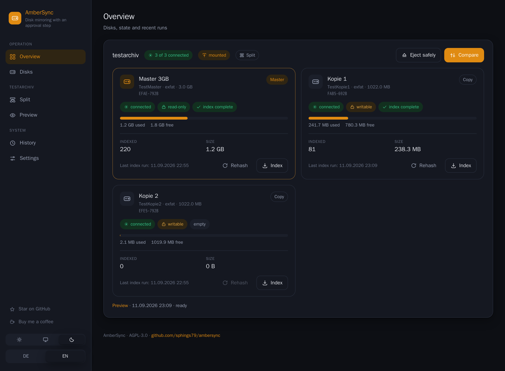
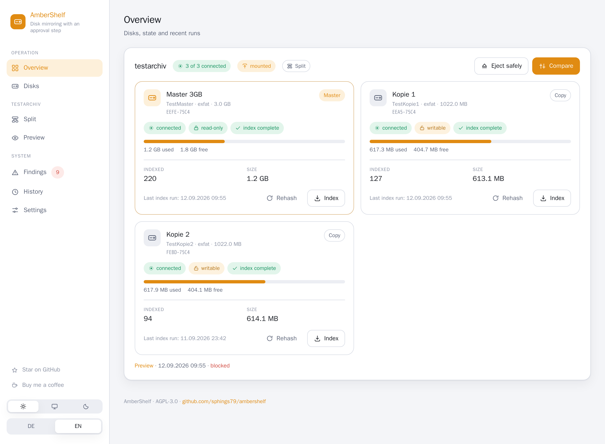
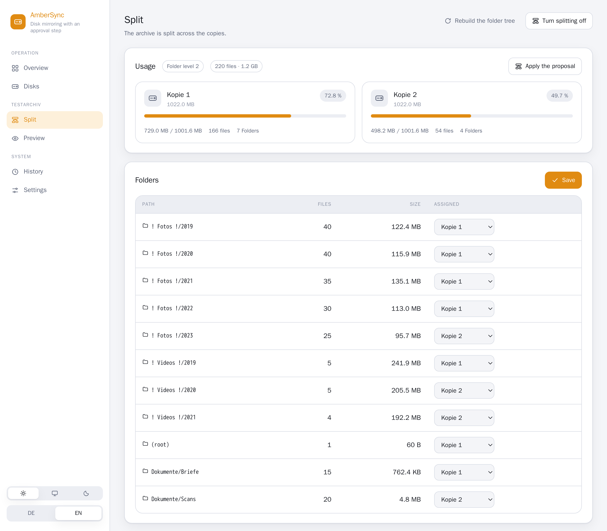
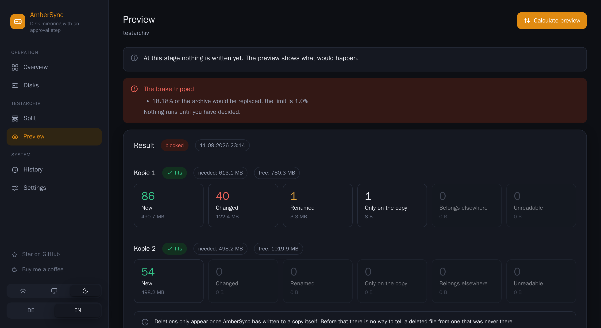
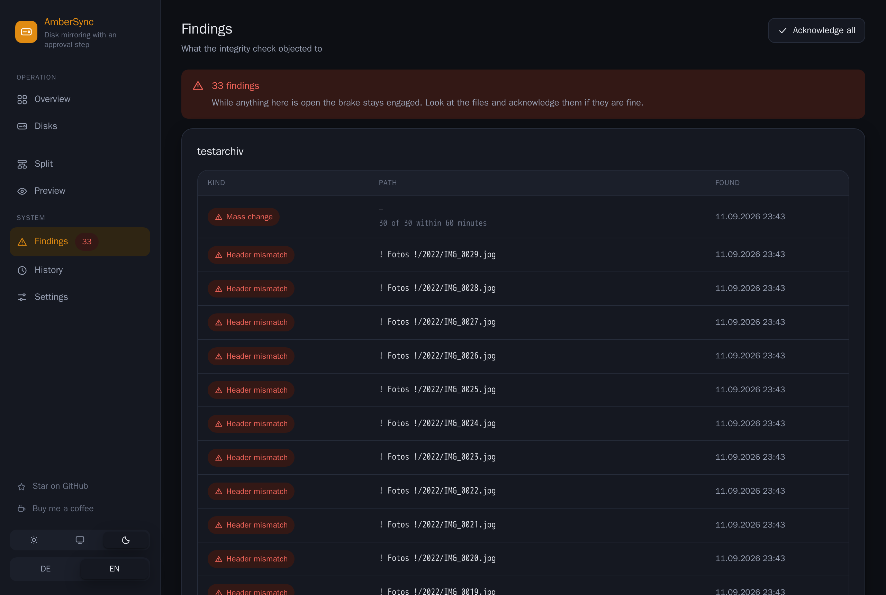
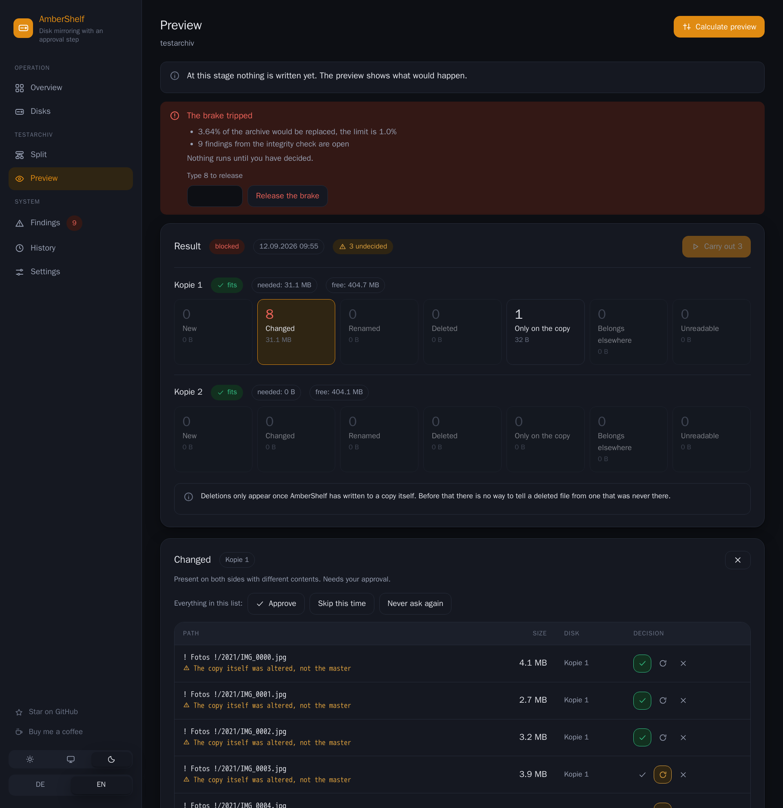
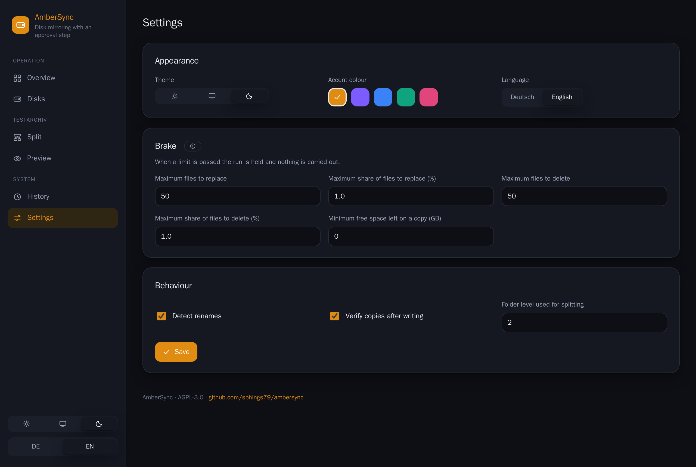

<div align="center">

# AmberShelf

### Einbahn-Plattenabgleich mit Freigabe — gebaut gegen Verschlüsselungstrojaner

**Spiegelt eine Master-Platte auf eine oder mehrere Sicherungsplatten, ohne jemals
hinter deinem Rücken etwas zu löschen oder zu überschreiben.** Selbst gehostet, Docker,
Weboberfläche, exFAT und NTFS — für Foto- und Videoarchive, die auf Platten im Schrank
liegen.

[](LICENSE)
[](compose.yaml)
[](requirements.txt)
[](#schnellstart)
[](https://buymeacoffee.com/sphings)

[English](README.md) · **Deutsch**

**Wenn dir AmberShelf nützt, gib dem Repo bitte einen ⭐ Stern** — anders finden Leute mit
demselben Problem es nicht.



</div>

---

## Das Problem dahinter

Ein Fotoarchiv ändert sich nicht. Es kommen Dateien dazu; geändert wird fast nie etwas,
und gelöscht wird selten und mit Absicht. Trotzdem versteht jedes übliche
Abgleichsprogramm „die Quelle hat sich geändert" als Auftrag, die Kopie mitzuändern —
also genau das, was du **nicht** willst, wenn die Quelle gerade von einem Trojaner
verschlüsselt, von einem defekten Kabel zerschossen oder von einem vertippten Befehl
geleert wurde.

AmberShelf dreht das um. Es liest beide Seiten, bildet den Unterschied über Prüfsummen und
**zeigt dir dann, was es tun würde**. Dateien hinzufügen ist Alltag. Eine ersetzen oder
löschen braucht deine Freigabe. Eine Massenänderung löst die Notbremse und hält den Lauf an.

Gebaut für den Umgang, den externe Platten in Wirklichkeit haben: gelegentlich
angesteckt, zwischen Mac und Windows-PC getragen, den Rest der Zeit im Schrank.

## Bildschirmfotos

| Übersicht — hell | Aufteilung auf mehrere Platten |
| --- | --- |
|  |  |

**Die Vorschau** — es wird nichts ausgeführt, bis du entschieden hast:



**Beschädigung wird erkannt, bevor sie weitergetragen wird** — ein JPEG, das nicht
mehr wie ein JPEG beginnt, ein Erpresserbrief, eine Massenänderung in einer Minute:



**Jede Ersetzung, Umbenennung und Löschung gibst du frei** — einzeln oder gesammelt, und
die Antwort wird gemerkt:



**Hell, dunkel und System, fünf Akzentfarben:**



## Eigenschaften

- **Der Master wird vom Kernel nur lesend eingehängt.** Nicht „das Programm schreibt da
  nicht hin" — das Dateisystem ist `ro` eingehängt, und die Flags werden gegengelesen,
  bevor ein einziges Byte gelesen wird. Auch ein Programmierfehler oder jemand, der den
  Container übernimmt, kommt an dein Original nicht heran.
- **Gegen Verschlüsselungstrojaner gebaut.** Nichts wird ohne deine Freigabe gelöscht oder
  überschrieben, und eine Massenersetzung oder -löschung löst eine einstellbare Notbremse
  aus — nach absoluter Zahl **und** nach Anteil am Bestand. Zum Lösen musst du die Zahl
  der betroffenen Dateien eintippen; wegklicken geht nicht.
- **Jede Kopie wird bewiesen.** Jede Datei wird unter Temporärnamen geschrieben, auf die
  Platte gezwungen, zurückgelesen und geprüft — erst dann umbenannt. Ein abgebrochener
  Lauf hinterlässt eine Temporärdatei, nie ein halbes Foto unter dem richtigen Namen.
- **Ersetzte und gelöschte Dateien werden geparkt**, nicht vernichtet — unter
  `.ambershelf-trash` auf der Kopie, mit dem Zeitstempel des Laufs, bis du selbst aufräumst.
- **Entscheidungen werden gemerkt.** Freigeben, diesmal übergehen oder nie wieder fragen;
  du arbeitest die Altlasten einmal ab statt bei jedem Lauf dieselben fünfzig Fälle.
- **Beschädigte Dateien werden erkannt, nicht vermutet.** Jede Datei wird gegen die
  Kopfbytes geprüft, die ihre Endung verspricht — ein `.jpg`, das nicht mehr mit
  `FF D8 FF` beginnt, ist kaputt, und genau das hinterlässt Verschlüsselung. Auch die
  schnelle Sorte, die nur die ersten Hunderttausend Bytes verwürfelt. Dazu Erpresserbriefe
  am Namen, sinnlose zweite Endungen und Massenänderungen innerhalb einer Stunde. Jeder
  Befund hält die Notbremse.
- **Eine Benachrichtigung, wenn es darauf ankommt.** Eine Adresse, ein kleines JSON —
  Home Assistant, ntfy, Gotify oder ein eigenes Skript. Kein Konto irgendwo.
- **Ein Passwort, sofern es überhaupt jemand anders erreichen könnte.** scrypt aus der
  Standardbibliothek, serverseitige Sitzungen, Sperre nach fünf Fehlversuchen — und beim
  ersten Start ein erzeugtes Passwort im Protokoll statt eines Einrichtungsbildschirms,
  den sich jeder schnappen könnte. Es öffnet die Tür ein einziges Mal: Als Erstes wirst
  du nach einem eigenen gefragt. Aus nur, wenn der Server allein auf loopback hört.
- **Plattenerkennung, die von innen nicht zu fälschen ist.** Eine Platte wird über
  Dateisystem-UUID und Seriennummer erkannt; die Zuordnung von Platte zu Rolle liegt in
  einer root-eigenen Datei auf dem Host, außerhalb der Reichweite des Containers. Ein
  umbenannter Ordner oder eine geklonte Platte können keine Richtung umdrehen.
- **Vergleich über Prüfsummen (SHA-256).** Nie über Zeitstempel — exFAT speichert die Zeit
  in Lokalzeit mit 10 ms Auflösung, was sich zwischen Rechnern oft genug unterscheidet, um
  als Beweis unbrauchbar zu sein.
- **Umbenennungserkennung.** Eine verschobene Datei behält ihren Platz, statt noch einmal
  kopiert und anschließend als Fremdkörper gemeldet zu werden.
- **Einen großen Master auf mehrere kleinere Platten aufteilen**, Ordner für Ordner, mit
  einer dauerhaften Warnung für alles, was auf keiner Kopie gelandet ist — der stille
  Fehler, der wirklich Daten kostet.
- **Fortsetzbares Einlesen.** Der erste Prüfsummenlauf über ein Terabyte dauert Stunden;
  er lässt sich anhalten, fortsetzen und übersteht einen Neustart des Containers mit
  höchstens einer verlorenen Datei.
- **Normale, durchsuchbare Kopien.** Eine Sicherungsplatte bleibt ein gewöhnlicher
  Ordnerbaum, den du an jedem Rechner ohne AmberShelf öffnen kannst — kein eigenes Format.
- **Unprivilegierter Container.** Kein `privileged`, keine Capabilities, kein Gerätezugriff.
- **Deutsche und englische Oberfläche**, helles/dunkles/System-Erscheinungsbild, fünf
  Akzentfarben.

## Aufbau

```
Host                                Container (unprivilegiert)
──────────────────────────────      ────────────────────────────
ambershelf-helper (root)             Weboberfläche
  · listet Blockgeräte                · Einlesen und Prüfsummen
  · hängt den Master nur lesend ein   · Vergleich und Vorschau
  · hängt Kopien schreibend ein       · Ordnerzuteilung
  · besitzt /etc/ambershelf/disks.conf · SQLite-Verzeichnis
          │                                      │
          └──── Unix-Socket ─────────────────────┘
          └──── /mnt/ambershelf (rshared bind) ───┘
```

Der Container kann nur darum **bitten**, einen Satz einzuhängen. Er benennt nie ein Gerät,
nie eine Einhänge-Option und entscheidet nie über eine Rolle — das ist es, was den Master
schützt, selbst wenn der Container vollständig übernommen wird.

Registrieren über den Socket geht **nur hinzufügend**, mit Absicht. Eine Rolle ändern oder
eine Registrierung entfernen verlangt einen bewussten Befehl auf dem Host; sonst wäre
Löschen-und-neu-anlegen ein Weg an der Regel vorbei.

## Drei Wege

| | Quelle schreibgeschützt | Braucht | Bezug |
| --- | --- | --- | --- |
| **Docker auf Linux** | **ja, vom Kernel** | einen Linux-Rechner | [unten](#schnellstart) |
| **macOS-App** | nein | macOS 12+, Apple Silicon | [Herunterladen](https://github.com/sphings79/ambershelf/releases/latest) |
| **Windows-App** | nein | Windows 10+ | [Herunterladen](https://github.com/sphings79/ambershelf/releases/latest) |

Die Desktop-Fassungen lesen die Datenträger, die das System ohnehin eingehängt hat —
keine Administratorrechte, kein Dienst, kein Hintergrundprozess. Was sie aufgeben, ist
die eine Zusage, die eine privilegierte Hälfte braucht: **sie können den Master nicht
schreibschützen** und sagen das auf jeder Seite. AmberShelf selbst schreibt nie auf ihn
— aber alles andere auf diesem Rechner kann es.

Beide Apps lassen sich auch auf ein AmberShelf anderswo richten (Einstellungen →
Verbindung). Dann sind sie ein Fenster auf die Docker-Fassung — mit der vollen Zusage
dahinter.

Nichts ist signiert, der erste Start kostet also einen Handgriff: unter macOS mit der
rechten Maustaste auf die App und **Öffnen** wählen, unter Windows im SmartScreen-Dialog
**Weitere Informationen → Trotzdem ausführen**.

## Schnellstart

Vorausgesetzt: ein Linux-Host mit Docker und systemd, `util-linux` und die Kernel-Treiber
für deine Dateisysteme (`exfat` seit 5.7, `ntfs3` seit 5.15 — beide sind in jeder aktuellen
Distribution dabei). `exfatprogs`, falls du einen unsauber getrennten exFAT-Datenträger
reparieren können willst.

```bash
git clone https://github.com/sphings79/ambershelf.git
cd ambershelf
sudo docker/install.sh      # Helfer, systemd-Unit, Gruppe, Verzeichnisse
docker compose up -d
```

Ein fertiges Image liegt unter `ghcr.io/sphings79/ambershelf:latest` für `linux/amd64`
und `linux/arm64` — trag es in `compose.yaml` bei `image:` ein, wenn du nicht selbst
bauen willst.

Die Oberfläche hört auf `127.0.0.1:8088`.

### Anmelden

Alles, was nicht allein über loopback erreichbar ist, verlangt ein Passwort — also jeder
Container und jede Installation hinter einem Reverse Proxy. **Beim ersten Start denkt
sich AmberShelf eines aus und schreibt es ins Protokoll:**

```bash
docker compose logs ambershelf | grep -A4 "first start"
```

Damit anmeldest du dich, und dann wirst du gebeten, ein eigenes festzulegen — vorher
geht nichts anderes. Einen Einrichtungsbildschirm gibt es bewusst nicht: Der gehört auf
einer erreichbaren Adresse dem, der ihn zuerst findet, während ein erzeugtes Passwort im
Protokoll nur dem die Tür öffnet, der dieses Protokoll ohnehin lesen kann.

Ein Passwort für die ganze Anwendung, mit scrypt aus der Standardbibliothek gehasht.
Sitzungen liegen serverseitig — das Abmelden wirkt also sofort überall — und fünf
Fehlversuche von einer Adresse kosten eine Pause.

Die Desktop-Apps hören örtlich nur auf `127.0.0.1` und fragen nicht; sie würden ihren
eigenen Benutzer fragen. Richtet man eine auf ein entferntes AmberShelf, meldet sie sich
an wie jeder Browser.

### Hinter einem Reverse Proxy

`docs/compose.override.example.yaml` als `compose.override.yaml` neben `compose.yaml`
legen — Docker Compose führt sie von selbst zusammen. Sie nimmt die
localhost-Bindung weg und hängt den Container ins Proxy-Netz. Ein passender
Traefik-Router liegt in [`docs/traefik-ambershelf.yml`](docs/traefik-ambershelf.yml).

Beschränke sie trotzdem auf dein eigenes Netz. Ein Passwort ist ein Schloss; eine
Oberfläche, die Dateien auf Sicherungsplatten löschen kann, verdient zwei.

## Benutzung

1. **Platten** — Platte anstecken, benennen, Rolle wählen, registrieren. Der Master wird
   gelesen, Kopien werden beschrieben.
2. **Übersicht** — Satz einhängen, dann jede Platte einlesen. Der erste Lauf prüfsummt alles.
3. **Aufteilung** (wahlweise) — Ordner den Kopien zuteilen. Der Baum beginnt auf Ordnerebene 2,
   `Fotos/2019` ist also eine Einheit. Alles Unzugeordnete wird als Warnung angezeigt.
4. **Vorschau** — vergleichen und genau ansehen, was passieren würde.

### exFAT und NTFS

Beides geht, auch gemischt innerhalb eines Satzes.

**exFAT** ist das einzige Dateisystem, das macOS und Windows ohne Zusatzsoftware lesen
**und** beschreiben können — deshalb gewinnt es bei Platten, die herumgereicht werden. Es
hat kein Journal, also schreibt AmberShelf über eine Temporärdatei und benennt erst um,
wenn die Prüfsumme stimmt, hängt nach jedem Lauf sauber aus und weigert sich, auf einen
Datenträger zu schreiben, dessen Dirty-Flag gesetzt ist.

**NTFS** hat ein Journal und ist robuster, aber macOS kann es nur lesen.

## Im Vergleich

| | AmberShelf | rsync | Syncthing | FreeFileSync |
| --- | --- | --- | --- | --- |
| Quelle physisch schreibgeschützt | **ja, `ro`-Mount** | nein | nein | nein |
| Löschungen brauchen Freigabe | **ja** | nein (`--delete` oder gar nicht) | nein | nur Nachfrage |
| Notbremse bei Massenänderung | **ja** | nein | nein | nein |
| Eine Quelle auf mehrere Ziele aufteilen | **ja** | nein | nein | nein |
| Merkt sich deine Entscheidungen | **ja** | nein | entfällt | nein |
| Ziel bleibt ein normaler Ordnerbaum | **ja** | ja | ja | ja |
| Laufend / in beide Richtungen | nein, bewusst | nein | ja | nein |
| Weboberfläche | **ja** | nein | ja | nein |

Wenn du laufenden Abgleich in beide Richtungen zwischen Rechnern willst, nimm Syncthing.
Wenn du einen skriptbaren Einzeiler willst, nimm rsync. AmberShelf ist für den Fall, dass
die Kopie der Quelle **nicht** in einen kaputten Zustand folgen darf.

## Häufige Fragen

**Schützt mich das vor Verschlüsselungstrojanern?**
Es schützt die *Kopie* vor einem Master, der bereits beschädigt ist — etwa weil die Platte
an einem befallenen Windows-PC hing. Jede Datei wird gegen die Kopfbytes geprüft, die ihre
Endung verspricht, Erpresserbriefe und sinnlose zweite Endungen fallen am Namen auf, und
eine Massenänderung innerhalb einer Stunde wird gemeldet; all das hält die Notbremse, und
es wird nichts geschrieben. Es schützt **nicht** davor, dass jemand den Host selbst
übernimmt. Dein eigentlicher Schutz dagegen ist, dass die Platten die meiste Zeit nicht
angesteckt sind — und AmberShelf ist so gebaut, dass es das nicht aufweicht.

**Warum keine Entropie-Messung?**
Weil sie bei einem Fotoarchiv nichts taugt. JPEG und MP4 sind bereits komprimiert und
sehen fast perfekt zufällig aus — „das sieht verschlüsselt aus" sagt über sie also nichts
und würde nur falsche Sicherheit geben. Textdateien deckt stattdessen eine Prüfung auf
darstellbare Zeichen ab, Fotos und Videos ihr Kopf, den Verschlüsselung ohnehin zerstört.

**Warum nicht einfach rsync?**
rsync kopiert Dateien gut. Was es nicht hat: einen Freigabe-Ablauf, eine Zustandsdatenbank,
Umbenennungserkennung über Prüfsummen, Aufteilung auf mehrere Ziele oder eine Notbremse.
Das alles um rsync herumzubauen heißt, den Großteil davon ohnehin nachzubauen — mit
weniger Kontrolle über jeden einzelnen Schritt.

**Kann es Dateien auf der Kopie löschen?**
Nur solche, die du freigibst, einzeln oder gesammelt — und erst, wenn AmberShelf selbst
einmal auf diese Kopie geschrieben hat. Vorher lässt sich eine gelöschte Datei nicht von
einer unterscheiden, die nie da war; das sagt es, statt zu raten. Gelöschte Dateien landen
standardmäßig unter `.ambershelf-trash` auf der Kopie — eine bereute Freigabe ist also
umkehrbar.

**Wie lange dauert der erste Lauf?**
Er liest und prüfsummt alles. Rechne grob mit 4 bis 8 Stunden je Terabyte über USB 3, je
nach Platte und Dateigrößen. Spätere Läufe prüfen nur, was sich geändert hat. Der Lauf
lässt sich anhalten und fortsetzen.

**Müssen die Platten dauerhaft angesteckt bleiben?**
Nein. Genau darum geht es. Anstecken, laufen lassen, auswerfen.

**Geht das auch ohne Docker?**
Ja — die macOS- und Windows-Apps sind genau das. Sie tragen dasselbe Rechenwerk und
dieselbe Oberfläche; nur die Plattform-Schicht ist anders, und mit ihr die
Schreibschutz-Zusage, die diese Systeme einer Anwendung ohne Sonderrechte nicht geben.

**Warum ist die macOS-App nicht signiert?**
Weil die Beglaubigung 99 € im Jahr kostet und das ein Feierabendprojekt ist. Beim ersten
Start mit der rechten Maustaste auf die App und **Öffnen** wählen; macOS merkt sich das.
Falls sich das ändert, fehlen dem Bauplan zwei Zeilen bis zur Signatur.

**Funktioniert es mit einer NAS-Freigabe, SMB oder NFS?**
Derzeit nicht. Es erkennt Platten über Dateisystem-UUID und Seriennummer, und die hat eine
Netzfreigabe nicht.

## Ausbaustand

| Abschnitt | Inhalt | Stand |
| --- | --- | --- |
| 1 | Host-Helfer, Registrierung, Einhängen | ✅ fertig |
| 2 | Einlesen, Prüfsummen, Vergleich, Vorschau | ✅ fertig |
| 3 | Kopieren mit Prüfung, Freigaben, Verlauf | ✅ fertig |
| 4 | Aufteilung auf mehrere Kopien, Deckungsprüfung | ✅ fertig |
| 5 | Integritätsprüfung, Benachrichtigungen | ✅ fertig |
| 6 | Desktop-Apps für macOS und Windows | ✅ fertig |

> **Aktueller Stand: vollständig.** Docker auf Linux hält den Master vom Kernel
> schreibgeschützt; macOS und Windows bekommen eine fertige App, die alles andere
> kann und offen sagt, was sie nicht kann.

## Mitmachen

Fehlermeldungen und Pull Requests sind willkommen — besonders Rückmeldungen zu
Dateisystemen und Plattengehäusen, die ich hier nicht testen kann. Kommentare, Namen und
Commit-Nachrichten bitte auf Englisch.

## Das Projekt unterstützen

Wenn dir AmberShelf eine Sicherung gerettet hat — oder auch nur einen Abend:

<a href="https://buymeacoffee.com/sphings">
  
</a>

Und ein ⭐ kostet nichts und hilft sehr.

## Lizenz

[AGPL-3.0-or-later](LICENSE). Benutzen, ändern, weitergeben — wer es anderen über ein Netz
anbietet, veröffentlicht seine Änderungen mit.

---

<sub>**Schlagwörter:** Plattenabgleich · Einbahn-Sync · Sicherungskopie · externe Festplatte
sichern · Schutz vor Verschlüsselungstrojanern · Fotoarchiv sichern · exFAT unter Linux ·
NTFS · selbst gehostet · Docker · rsync-Alternative · FreeFileSync-Alternative ·
schreibgeschützte Quelle · Prüfsummen · SHA-256 · Sicherung auf mehrere Platten aufteilen ·
Kaltlagerung · USB-Platte spiegeln · Freigabe-Ablauf</sub>
